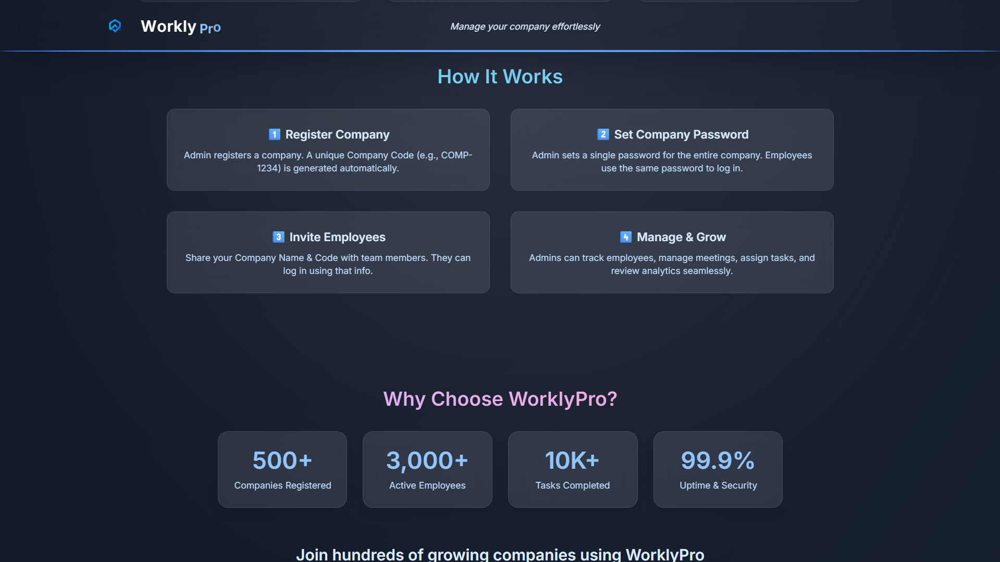
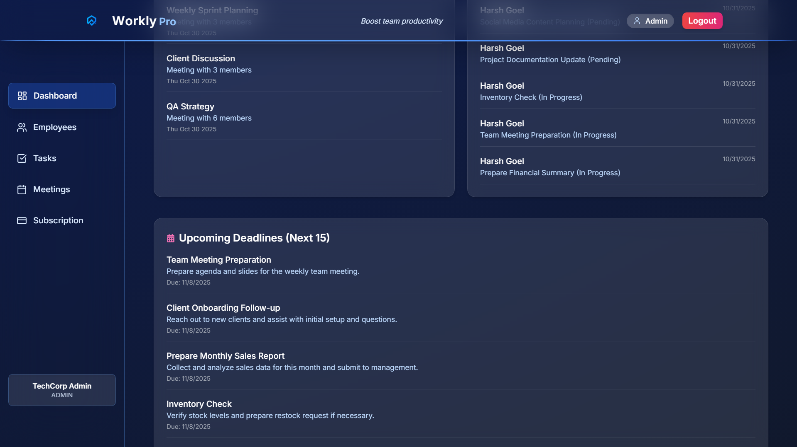
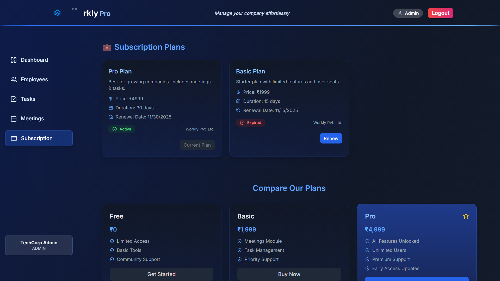

# 🚀 WorklyPro – Complete Company Management System

WorklyPro is a modern **full-stack company management platform** designed to simplify business operations, boost productivity, and connect admins and employees under one efficient system.

---

## 📸 Project Screenshots

### 🏠 Welcome Screen


### 📊 Main Dashboard


### 📊 Main Dashboard (2)


### 🧑‍💼 Admin Dashboard


### 🧑 Admin Dashboard (2)


### 👥 Employees Page


### 🗓️ Meetings Page


### ✅ Tasks Page


### 💳 Subscription Page


---

## 🏢 Project Overview

WorklyPro provides a complete environment where:

* **Admins** can manage employees, meetings, and tasks.
* **Employees** can view assigned tasks, salary, and meetings in one unified dashboard.

The platform improves team communication, performance tracking, and overall company management efficiency.

---

## 🔐 Login & Registration

Since the project does not include preloaded MongoDB data, you can **register your own company and employees** and then login using those credentials.

### **Company & Admin Registration**

1. Go to the **registration page** in the app.
2. Enter the following:

   * Company Name
   * Company Email
   * Admin Name
   * Admin Email
   * Password
3. Upon registration:

   * A **unique Company Code** will be generated automatically.
   * Admin can log in using **Company Name + Company Code + Password**.

### **Employee Registration**

* Admin can add employees from the **dashboard** after company registration.
* Required fields for employee:

  * Name
  * Email
  * Designation / Position
  * Salary & Bonus (optional)
  * Password (default can be set to `123456`)
* Employees can log in using:

  * Company Name
  * Company Code
  * Employee Name
  * Password

### **Login**

* Navigate to the **login page**.
* Enter your **Company Name + Company Code + Email + Password**.
* The system will redirect you to either:

  * **Admin Dashboard** (if admin)
  * **Employee Dashboard** (if employee)

> ✅ Tip: Once a company is registered, all employees must be added by the admin before they can log in.

---

## ⚙️ Key Features

### 👨‍💼 Admin Features

* Register company with unique Company Code
* Add, update, and delete employees
* Assign and track tasks
* Schedule and manage meetings
* View company-wide performance & analytics
* Manage salary and bonus details
* See upcoming deadlines and recent activities

### 👨‍🔧 Employee Features

* Login using Company Name, Code, and Password
* View assigned tasks and completion progress
* Check upcoming meetings
* Access salary and bonus information
* Monitor performance charts
* View personal productivity analytics

---

## 🧰 Tech Stack

### Frontend

* ⚡ React.js (Vite)
* 🎨 Tailwind CSS
* ✨ Framer Motion (animations)
* 🧮 Recharts (analytics & charts)
* 🔔 Lucide React / React Icons (UI icons)

### Backend

* ⚙️ Node.js + Express.js
* 🗄️ MongoDB + Mongoose
* 🔑 JWT Authentication
* 🌐 RESTful APIs
* 🧩 CORS and Environment Configuration

---

## 📊 Dashboard Overview

### Admin Dashboard

* 👥 Employee Summary (with DOJ & contact)
* 📝 Task Assignment & Tracking
* 📅 Meeting Management
* 💰 Salary and Bonus Overview
* 📈 Performance Charts (weekly progress)
* 🕒 Upcoming Deadlines (next 15 tasks)
* 🗞️ Announcements (auto from meetings)
* 📋 Recent Activities (employee updates)

### Employee Dashboard

* 🧾 Salary and Bonus card
* ✅ Task progress overview
* 🗓️ Meetings schedule
* 📊 Weekly performance chart

---

## 🪄 UI Highlights

* Clean, modern dark mode interface
* Glassmorphism and gradient UI design
* Fully responsive for all devices
* Smooth animations using Framer Motion
* Organized layout with modular components
* Beautiful typography using Inter & Roboto

---

## ⚡ Setup Instructions

1. **Clone the repository**

```bash
git clone <repo-url>
cd worklypro
```

2. **Install backend dependencies**

```bash
cd backend
npm install
```

3. **Install frontend dependencies**

```bash
cd ../frontend
npm install
```

4. **Set environment variables**

* Create `.env` in backend with:

```
MONGO_URI=<your-mongo-uri>
JWT_SECRET=<your-jwt-secret>
```

5. **Start backend**

```bash
cd backend
npm run dev
```

6. **Start frontend**

```bash
cd frontend
npm run dev
```

7. **Register a company & admin**, add employees, then log in using those credentials.

---

This project is open-source and available under the MIT License.

🧑‍💻 Developed By

Tushar Rathore

🚀 Full-Stack Developer | MERN Enthusiast

📧 Email: [tusharrathore853@gmail.com]

🌐 GitHub: [https://github.com/tusshar-25]

>>>>>>> e15ce0f9ca6cdb4f3685caff835275a8ff8167b6
